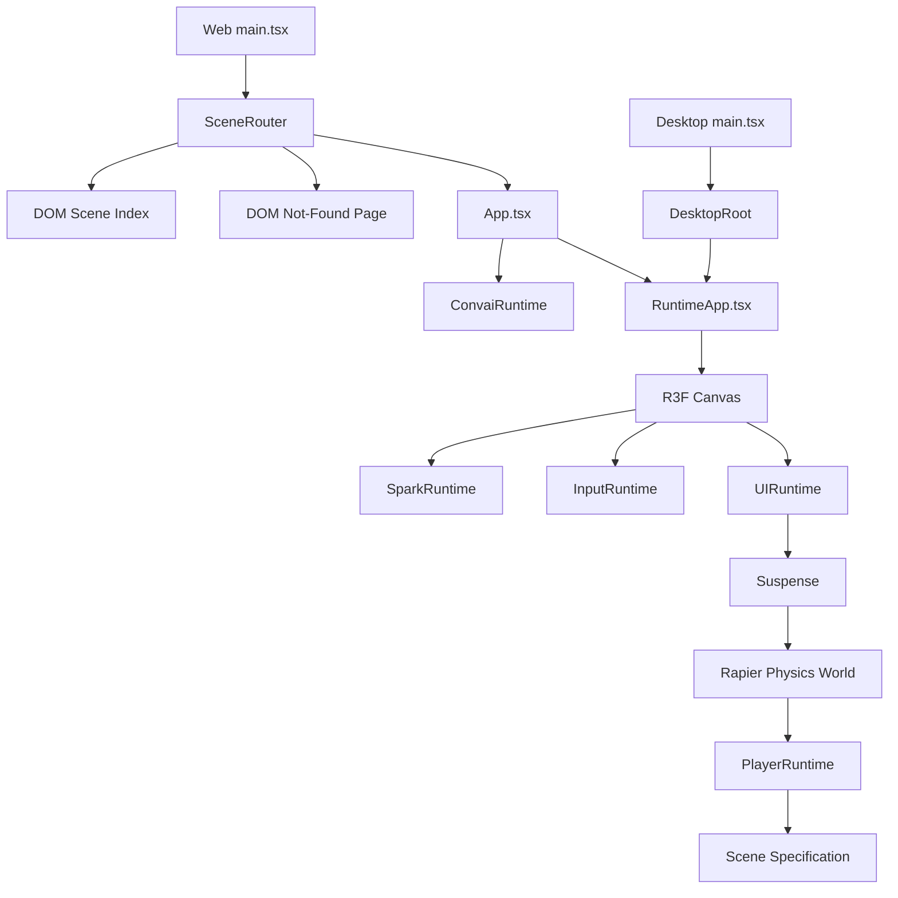
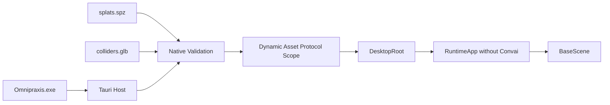
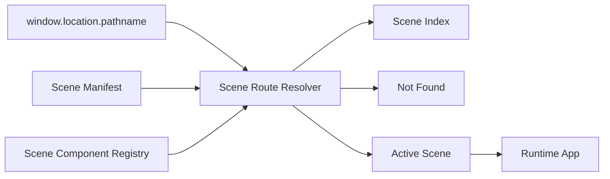
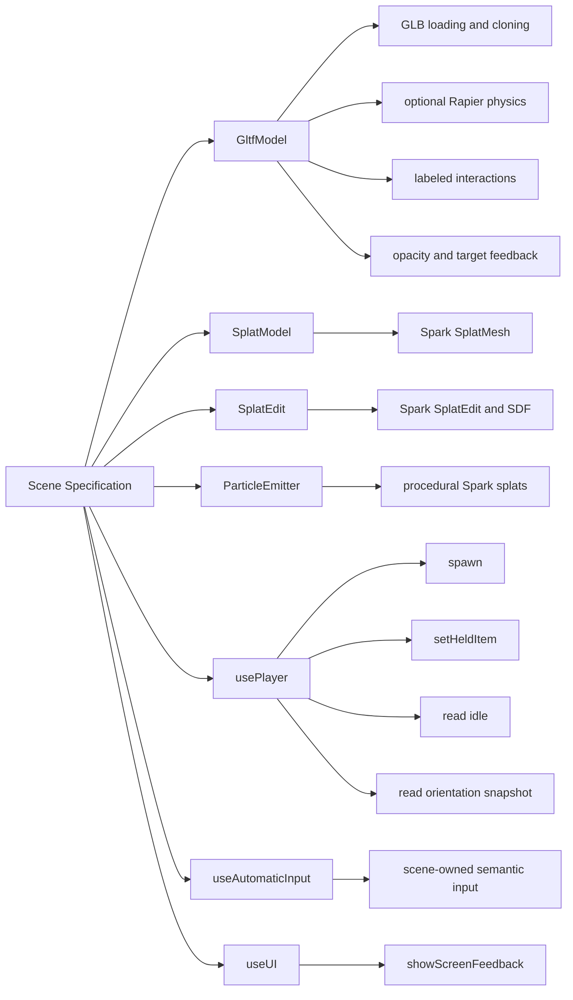
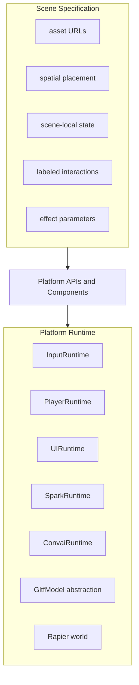
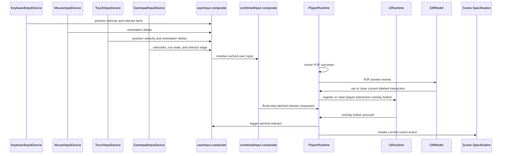
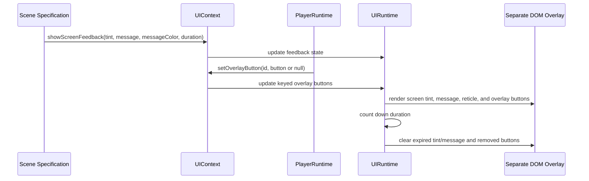
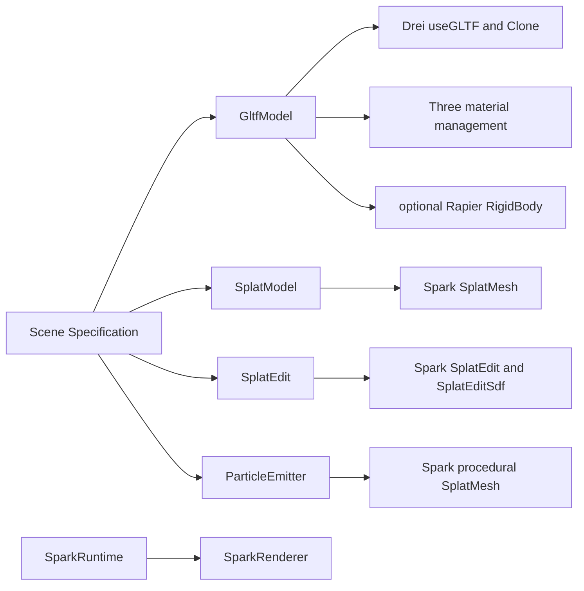
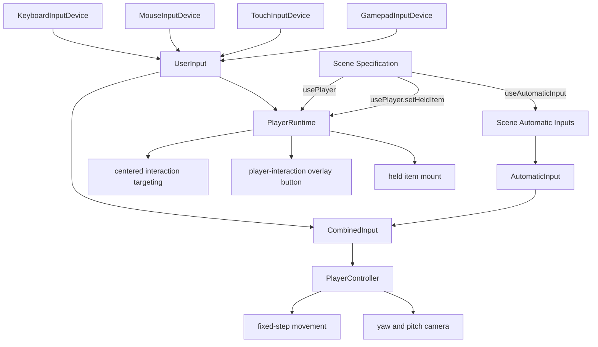

# Omnipraxis Platform Architecture

This document describes Omnipraxis as a reusable scene-authoring platform. It does not document any specific training scenario, authored content, or scene-local state machine.

The core architectural boundary is between the platform runtime and a scene specification.

- The platform runtime owns input, player movement, centered interaction targeting, UI overlays, generic overlay controls, Spark renderer setup, physics setup, and reusable asset/effect abstractions.
- A scene specification owns asset URLs, component composition, transforms, local state, effect parameters, and scene-specific labeled interactions.

## Runtime Stack

The web entry uses `SceneRouter.tsx` to select the root scene index, an unknown-route page, or a registered scene from the current pathname. `App.tsx` adds web-only services such as Convai to `RuntimeApp.tsx`, which composes the reusable runtime shell for a selected scene. The desktop entry bypasses routing and mounts `BaseScene` directly in `RuntimeApp` without Convai.



## Windows Desktop Boundary

The Tauri desktop host is a platform adapter around the shared browser renderer. It embeds the routing-free desktop Vite output in the native executable, validates the external BaseScene files, and exposes only those exact paths to WebView2 through Tauri's asset protocol.



Release builds resolve `splats.spz` and `colliders.glb` from the executable directory. Debug builds use `public/scenes/base/`, while `OMNIPRAXIS_SCENE_DIR` provides an explicit development override. The host checks file readability, the SPZ gzip signature, and GLB 2 header/length before returning protocol URLs. Loader or render failures are surfaced by the desktop error UI instead of intentionally falling back to embedded scene assets.

The desktop renderer uses a dedicated Vite configuration with `base: './'`, `publicDir: false`, and `build/desktop` output. This prevents the web scene index, Convai integration, and complete public asset tree from becoming part of the desktop renderer. Its CSP permits `data:` fetches and workers because Spark initializes trusted embedded WASM and provides a data-worker fallback. The current portable artifact depends on an installed Evergreen WebView2 runtime and is intentionally unsigned while feasibility is evaluated.

## Scene URL Routing

Scene routing is a platform concern outside the R3F runtime. `sceneManifest.ts` defines stable public slugs and display metadata without importing React, while `sceneRegistry.ts` maps every slug to a prop-free scene component. `sceneRoute.ts` strips `import.meta.env.BASE_URL`, resolves the initial pathname, and rejects unknown or nested paths.



The root `/omnipraxis/` route renders a DOM scene index outside the Canvas. Scene links preserve the current query string and hash, call `history.pushState`, and update the selected route without requesting another document. `SceneRouter` listens for `popstate` so browser Back and Forward restore the corresponding route. The runtime `App` is keyed by scene slug, ensuring that player, physics, UI, input-device, Convai, and scene-local state do not leak between active scene sessions.

GitHub Pages currently serves only the root `index.html` and does not rewrite arbitrary paths to that shell. Consequently, a nested scene URL works after navigation from the loaded scene index, but directly loading or refreshing that URL returns a Pages 404. A future build step can use the React-free manifest to emit identical processed HTML shells at each registered scene path; the initial-path resolver already supports those direct entries without further runtime changes.

## Scene Authoring API Surface

A scene specification should compose platform-provided primitives rather than directly binding to lower-level libraries when a platform abstraction exists.



## Ownership Boundaries

Platform runtime systems should own persistent cross-scene behavior. Scene specifications should own authored content and local behavior.



## Platform Responsibilities

The shared runtime provides these reusable capabilities to mounted scene specifications. Platform adapters can add environment-specific services around that shell.

- `Canvas` and render-loop hosting through React Three Fiber.
- `SparkRuntime` for `SparkRenderer` setup.
- `InputRuntime` for keyboard, mouse, touch, a frame-polled standard gamepad, pointer lock, and resolving composable semantic input sources.
- `PlayerRuntime` for spawn lifecycle, centered interaction targeting, held items, fixed-step latched interaction consumption, and registering the current interaction overlay button.
- `PlayerController` for fixed-step walk/run movement and camera yaw/pitch, Rapier character-controller movement, and held-item mounting.
- `UIRuntime` for screen tint, top-center screen messages, reticle DOM overlay rendering, and generic keyed overlay buttons.
- The web `App` adds `ConvaiRuntime` for the stock Convai widget overlay; the desktop adapter intentionally omits it.
- `GltfModel` for GLB loading, cloning, opacity, material feedback, interaction targeting, optional physics, and blocking behavior.
- `SplatModel` for Spark splat loading and scene-scoped child Spark edit nodes.
- `SplatEdit` for Spark SDF edit operations without scene code importing Spark internals.
- `ParticleEmitter` for procedural Spark-based particle effects.

## Scene Specification Responsibilities

A scene specification provides authored content and scene-specific logic.

- A prop-free scene component in its own file under `src/scenes/`, registered through the scene manifest and component registry.
- Asset URLs using `import.meta.env.BASE_URL` where assets are loaded from public paths.
- Component composition using platform primitives.
- Spatial placement through positions, rotations, scales, and visibility/opacity controls.
- Scene-local state and transitions.
- Labeled `PlayerInteraction` objects passed into platform components.
- Effect parameters for particles, splat edits, lights, and other scene-owned effects.
- Calls into `usePlayer` for player spawning and held-item state.
- Reads player idle state and orientation snapshots when scene-local behavior needs them.
- Registers scene-local automatic input sources through `useAutomaticInput`.
- Calls into `useUI` for screen feedback when scene-local logic needs it.

## Scene Specification Should Not Own

These responsibilities should remain in the platform runtime unless the platform API changes intentionally.

- Low-level keyboard, mouse, touch, or gamepad handling.
- Pointer lock setup.
- Player movement or camera yaw/pitch implementation.
- Centered raycaster computation.
- DOM overlay roots inside the R3F tree.
- Interaction overlay button rendering or layout.
- Spark renderer setup.
- Raw Spark imports when a platform wrapper exists.
- Raw `useGLTF` calls when `GltfModel` can represent the asset.
- Global physics-world setup.

## Interaction Targeting Flow

Interaction targeting is owned by the player runtime. Scenes provide labeled interactions, but do not own input collection, raycaster centering, or overlay button rendering.



## UI Feedback And Overlay Flow

UI feedback and overlay controls are platform services. Scene specifications request feedback through `useUI`, while platform runtimes such as `PlayerRuntime` can register generic overlay buttons by stable ID. `UIRuntime` owns rendering, timing, placement, and styling.



## Rendering And Asset Abstractions

Rendering details are hidden behind platform components. Scene specifications should express intent through these components instead of reaching into renderer internals.



## Input And Player Boundary

Input devices write to independent semantic states. Composite sources resolve the user-device states into `userInput`, scene-owned automatic states into `automaticInput`, and those two aggregates into the final player input. Player systems consume the final aggregate, while idle detection reads the cached user aggregate. Scenes interact with the player and automatic-input registration through narrow APIs.



Input states remain device-agnostic. Position and orientation each expose delta and velocity modalities. Deltas are resolved spatial displacements consumed once, while velocities are persistent controls integrated by the owning runtime. The current non-XR player consumes position and pitch/yaw orientation input during fixed physics steps; vertical position velocity and roll orientation input remain unused by the current yaw/pitch player hierarchy.

Composite inputs add deltas and velocities and combine run and interaction state. `InputRuntime` resolves the complete composite once after polling devices, so the cached user aggregate supports idle detection without another device traversal. The player normalizes combined horizontal velocity when its magnitude exceeds one. Position velocity is scaled by walk or run speed and the fixed physics timestep. Orientation velocity is scaled by turn speed and the same fixed timestep, while orientation deltas have already been resolved by their source and are not speed-scaled. Pending deltas are applied and cleared by the first eligible physics step; velocities and held run state persist until their sources change or reset.

Keyboard WASD provides position velocity, either Shift key contributes held run state, and non-repeated `KeyE` requests interaction. Mouse movement and unclaimed touch drags provide orientation deltas, while touch movement uses a transient lower-left floating joystick. Touch interaction is performed through the player-owned overlay button rendered by `UIRuntime`, not by `TouchInputDevice`.

`GamepadInputDevice` polls `navigator.getGamepads()` before physics consumers. It selects one standard-mapped controller, applies radial deadzones to both sticks, maps the left stick to position velocity, maps the right stick to orientation velocity, maps L1 to held run state, and maps the rising edge of A/Cross to interaction. Its sampled velocities do not depend on render delta; `PlayerController` integrates them during fixed physics steps. Disconnect, focus loss, hidden visibility, and disposal remove persistent controller contributions, and newly selected or resumed controllers baseline the interaction button to avoid an accidental action from a held button.

## Platform API Summary

### `usePlayer`

`usePlayer` exposes player-owned services to scene specifications.

```ts
spawn(position, yaw?, pitch?)
setHeldItem(heldItem)
idle
getOrientation()
```

`idle` becomes true after five seconds without resolved user input after spawning. Automatic input does not affect it. `getOrientation()` returns the current yaw and pitch without publishing per-frame React state.

### `useAutomaticInput`

`useAutomaticInput` registers an independent scene-owned input state in the automatic-input aggregate. It exposes the same delta, velocity, run, and interaction mutations used by device input. Multiple automatic sources combine, and unmounting a source removes its contribution.

The player runtime also exposes lower-level interaction target methods through context for platform components such as `GltfModel`. Scene specifications generally provide labeled interactions to `GltfModel` instead of calling those methods directly.

### `useUI`

`useUI` exposes UI-owned services to scene specifications and platform runtimes.

```ts
showScreenFeedback(tintColor, message, messageColor, duration);
setOverlayButton(id, button | null);
```

`setOverlayButton` is a generic UI service. Callers provide a stable ID, label, press callback, semantic placement, and optional priority. `UIRuntime` owns the DOM, stacking, placement, and visual styling; callers own the button meaning.

### `GltfModel`

`GltfModel` is the platform GLB boundary.

```ts
url;
position;
rotation;
scale;
opacity;
visible;
physicality;
colliders;
interaction;
interactionDistance;
blocksInteractions;
```

`interaction` is either `null` or a `PlayerInteraction` object:

```ts
{
  label: string;
  action: () => void;
}
```

The label is mandatory because it is shown by the player-owned overlay button. If a scene state changes the available label or behavior, select a different `PlayerInteraction` object for that state rather than branching inside one action.

### `SplatModel`

`SplatModel` is the platform splat asset boundary.

```ts
url;
paged;
onInitialized;
children;
```

### `SplatEdit`

`SplatEdit` encapsulates Spark edit and SDF nodes.

```ts
type;
rgbaBlendMode;
sdfSmooth;
softEdge;
invert;
sdfInvert;
opacity;
color;
displace;
radius;
position;
rotation;
scale;
```

### `ParticleEmitter`

`ParticleEmitter` provides procedural Spark particles.

```ts
particleCount;
spawnRadius;
velocity;
turbulence;
lifetime;
baseScale;
scaleGrowth;
opacity;
colors;
emitting;
position;
rotation;
```
