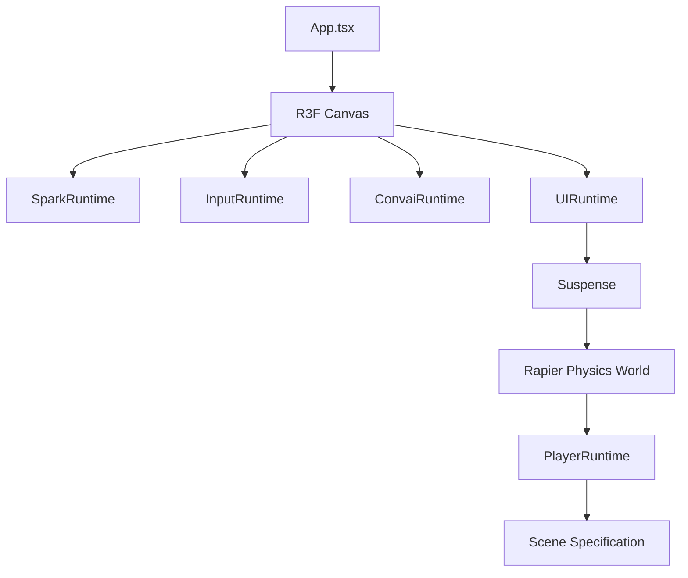
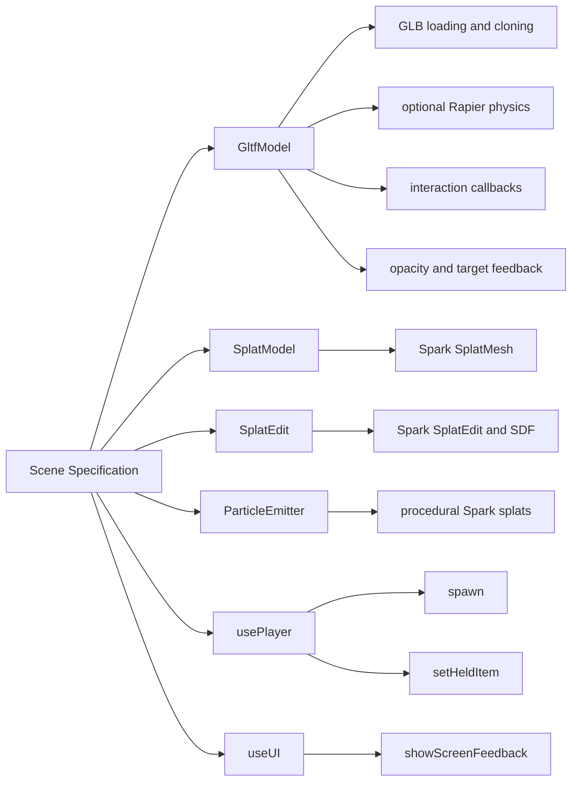
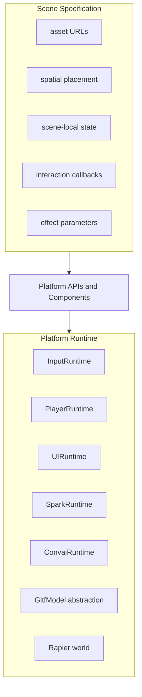
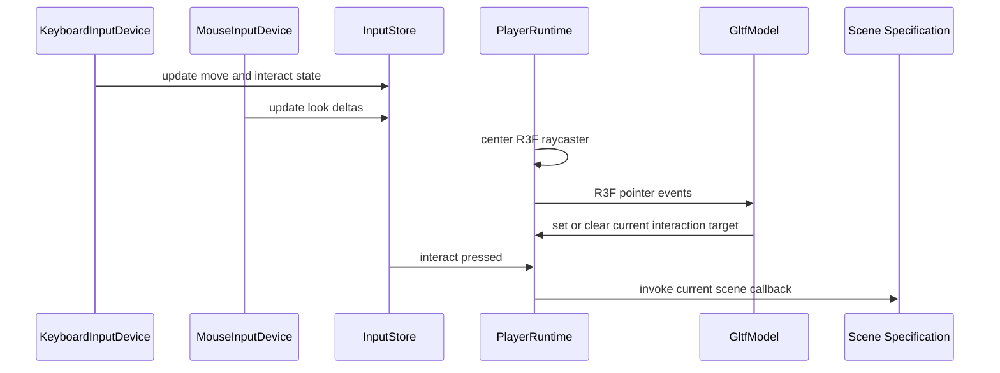
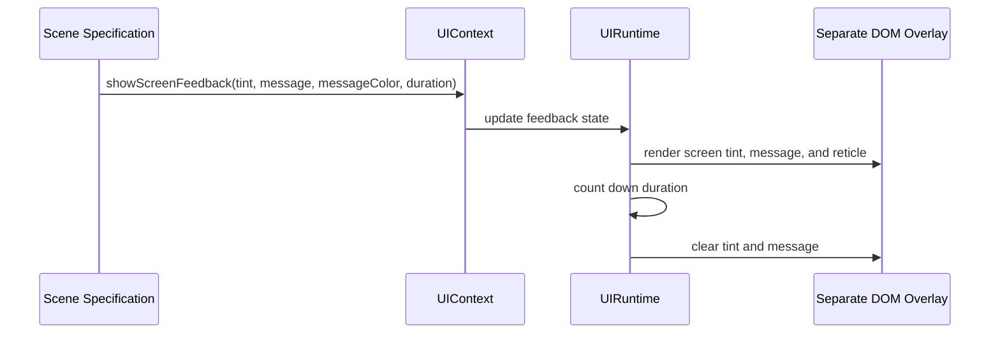
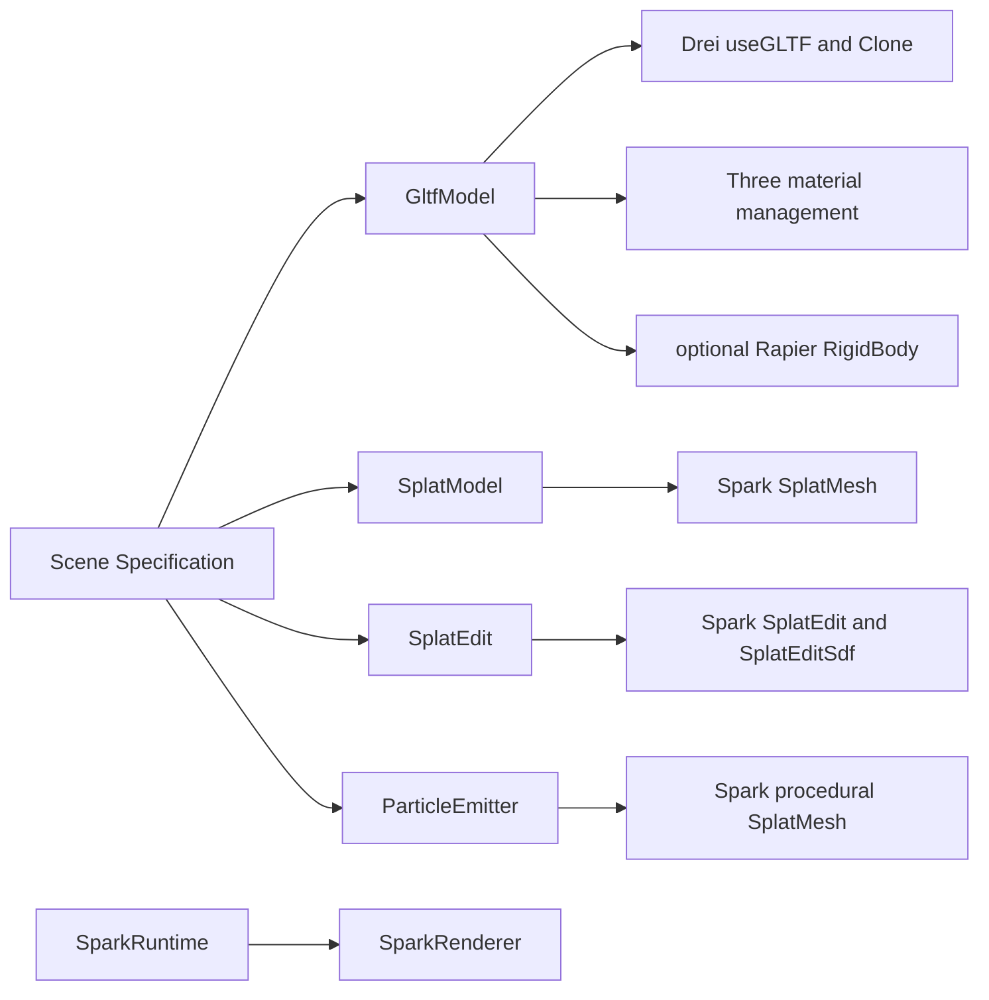
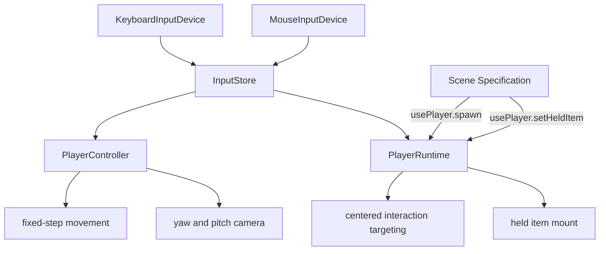

# Omnipraxis Platform Architecture

This document describes Omnipraxis as a reusable scene-authoring platform. It does not document any specific training scenario, authored content, or scene-local state machine.

The core architectural boundary is between the platform runtime and a scene specification.

- The platform runtime owns input, player movement, centered interaction targeting, UI overlays, Spark renderer setup, physics setup, and reusable asset/effect abstractions.
- A scene specification owns asset URLs, component composition, transforms, local state, effect parameters, and scene-specific interaction callbacks.

## Runtime Stack

`App.tsx` composes the reusable runtime shell. A scene is mounted beneath the platform services it is allowed to consume.



## Scene Authoring API Surface

A scene specification should compose platform-provided primitives rather than directly binding to lower-level libraries when a platform abstraction exists.



## Ownership Boundaries

Platform runtime systems should own persistent cross-scene behavior. Scene specifications should own authored content and local behavior.



## Platform Responsibilities

The platform provides these reusable capabilities to every scene specification.

- `Canvas` and render-loop hosting through React Three Fiber.
- `SparkRuntime` for `SparkRenderer` setup.
- `InputRuntime` for keyboard, mouse, pointer lock, and input-store mutation.
- `PlayerRuntime` for spawn lifecycle, centered interaction targeting, held items, and current interaction callbacks.
- `PlayerController` for fixed-step movement, camera yaw/pitch, Rapier character-controller movement, and held-item mounting.
- `UIRuntime` for screen tint, top-center screen messages, and reticle DOM overlay rendering.
- `ConvaiRuntime` for the stock Convai widget overlay.
- `GltfModel` for GLB loading, cloning, opacity, material feedback, interaction targeting, optional physics, and blocking behavior.
- `SplatModel` for Spark splat loading and scene-scoped child Spark edit nodes.
- `SplatEdit` for Spark SDF edit operations without scene code importing Spark internals.
- `ParticleEmitter` for procedural Spark-based particle effects.

## Scene Specification Responsibilities

A scene specification provides authored content and scene-specific logic.

- Asset URLs using `import.meta.env.BASE_URL` where assets are loaded from public paths.
- Component composition using platform primitives.
- Spatial placement through positions, rotations, scales, and visibility/opacity controls.
- Scene-local state and transitions.
- Interaction callbacks passed into platform components.
- Effect parameters for particles, splat edits, lights, and other scene-owned effects.
- Calls into `usePlayer` for player spawning and held-item state.
- Calls into `useUI` for screen feedback.

## Scene Specification Should Not Own

These responsibilities should remain in the platform runtime unless the platform API changes intentionally.

- Low-level keyboard or mouse listeners.
- Pointer lock setup.
- Player movement or camera yaw/pitch implementation.
- Centered raycaster computation.
- DOM overlay roots inside the R3F tree.
- Spark renderer setup.
- Raw Spark imports when a platform wrapper exists.
- Raw `useGLTF` calls when `GltfModel` can represent the asset.
- Global physics-world setup.

## Interaction Targeting Flow

Interaction targeting is owned by the player runtime. Scenes provide callbacks, but do not own input collection or raycaster centering.



## UI Feedback Flow

UI feedback is a platform service. Scene specifications request feedback through `useUI`, and `UIRuntime` owns rendering and timing.



## Rendering And Asset Abstractions

Rendering details are hidden behind platform components. Scene specifications should express intent through these components instead of reaching into renderer internals.



## Input And Player Boundary

Input devices mutate a shared store. Player systems consume that store. Scenes interact with the player through a narrow context API.



## Platform API Summary

### `usePlayer`

`usePlayer` exposes player-owned services to scene specifications.

```ts
spawn(position, yaw?, pitch?)
setHeldItem(heldItem)
```

The player runtime also exposes lower-level interaction target methods through context for platform components such as `GltfModel`. Scene specifications generally provide callbacks to `GltfModel` instead of calling those methods directly.

### `useUI`

`useUI` exposes UI-owned services to scene specifications.

```ts
showScreenFeedback(tintColor, message, messageColor, duration);
```

### `GltfModel`

`GltfModel` is the platform GLB boundary.

```ts
url;
position;
rotation;
scale;
opacity;
visible;
physicality;
colliders;
interaction;
interactionDistance;
blocksInteractions;
```

### `SplatModel`

`SplatModel` is the platform splat asset boundary.

```ts
url;
paged;
onInitialized;
children;
```

### `SplatEdit`

`SplatEdit` encapsulates Spark edit and SDF nodes.

```ts
type;
rgbaBlendMode;
sdfSmooth;
softEdge;
invert;
sdfInvert;
opacity;
color;
displace;
radius;
position;
rotation;
scale;
```

### `ParticleEmitter`

`ParticleEmitter` provides procedural Spark particles.

```ts
particleCount;
spawnRadius;
velocity;
turbulence;
lifetime;
baseScale;
scaleGrowth;
opacity;
colors;
emitting;
position;
rotation;
```
